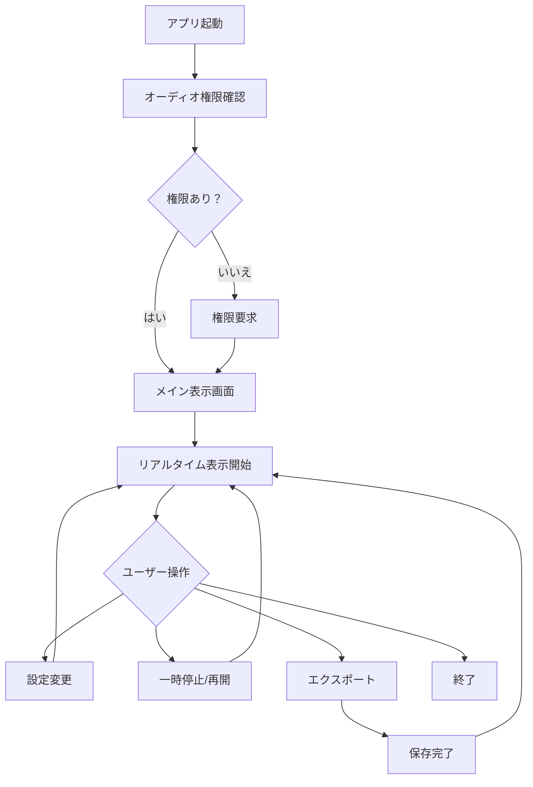

## 1. Product Overview
リアルタイム・メルスペクトログラム（ウォーターフォール）表示モバイルアプリケーション。音声信号をリアルタイムで解析し、視覚的なスペクトログラムとして表示する。

音響分析、音声認識、音楽制作、教育用途で使用される。プロフェッショナルから一般ユーザーまで、音声の周波数特性を視覚的に理解するためのツール。

## 2. Core Features

### 2.1 User Roles
| Role | Registration Method | Core Permissions |
|------|---------------------|------------------|
| Normal User | No registration required | Basic spectrogram viewing, standard settings |
| Premium User | In-app purchase | Advanced features, custom color schemes, export functionality |

### 2.2 Feature Module
リアルタイムメルスペクトログラムアプリは以下の主要ページで構成される：

1. **メイン表示画面**: リアルタイムスペクトログラム表示、コントロールパネル、設定アクセス
2. **設定画面**: 周波数範囲、色設定、更新間隔、オーディオ入力設定
3. **エクスポート画面**: データ保存、画像/動画エクスポート、共有機能

### 2.3 Page Details
| Page Name | Module Name | Feature description |
|-----------|-------------|---------------------|
| メイン表示画面 | スペクトログラム表示 | リアルタイムで音声をメルスペクトログラムとして表示する。更新間隔40-60ms、64メルバンド。 |
| メイン表示画面 | コントロールパネル | 開始/停止ボタン、一時停止、リセット、スケール調整。 |
| メイン表示画面 | ステータス表示 | FPS、遅延時間、CPU使用率、温度モニタリング。 |
| 設定画面 | オーディオ設定 | サンプリング周波数選択（16k/32k/44.1kHz）、入力感度調整。 |
| 設定画面 | 表示設定 | 色スキーム変更、周波数範囲設定、時間軸スケール調整。 |
| 設定画面 | パフォーマンス設定 | 省電力モード、品質設定、自動スケールダウン設定。 |
| エクスポート画面 | データエクスポート | スペクトログラムデータのCSV/JSON形式での保存。 |
| エクスポート画面 | 画像エクスポート | 現在の表示をPNG/JPG形式で保存。 |
| エクスポート画面 | 動画エクスポート | 記録したスペクトログラムをMP4形式で保存（Premium機能）。 |

## 3. Core Process

### 通常ユーザーフロー：
1. アプリ起動 → オーディオ権限要求 → メイン表示画面
2. 自動的にリアルタイムスペクトログラム表示開始
3. 設定ボタンで各種パラメータ調整可能
4. エクスポートボタンでデータ/画像保存

### プレミアムユーザーフロー：
1. 通常ユーザーと同じ基本フロー
2. 追加で高度な設定とエクスポート機能利用可能

## 4. User Interface Design

### 4.1 Design Style
- **プライマリカラー**: ダークグレー (#1a1a1a) - 背景、黒 (#000000) - スペクトログラム背景
- **セカンダリカラー**: 電光青 (#00ff88) - アクセント、オレンジ (#ff6600) - 警告
- **ボタンスタイル**: フラットデザイン、角丸4px、ホバー時に輝度変化
- **フォント**: SF Pro Display (iOS)、Roboto (Android)、サイズは14-18px
- **レイアウト**: カードベース、上部にスペクトログラム、下部にコントロール
- **アイコン**: Material Designアイコンセット、線画スタイル

### 4.2 Page Design Overview
| Page Name | Module Name | UI Elements |
|-----------|-------------|-------------|
| メイン表示画面 | スペクトログラム表示 | ダーク背景、512×256ピクセル表示領域、カラーマップはviridis風、時間軸は右から左へ流れる |
| メイン表示画面 | コントロールパネル | 下部に配置、円形ボタン、透過背景、タッチフィードバックあり |
| 設定画面 | オーディオ設定 | スライダー、ドロップダウン、リアルタイムプレビュー付き |
| エクスポート画面 | エクスポートオプション | グリッドレイアウト、大きなタッチターゲット、進捗表示 |

### 4.3 Responsiveness
- **モバイルファースト**: スマートフォン向けに最適化
- **タブレット対応**: 画面サイズに応じて拡大、横画面時は横分割レイアウト
- **タッチ最適化**: 最小タッチターゲット44×44px、スワイプジェスチャー対応