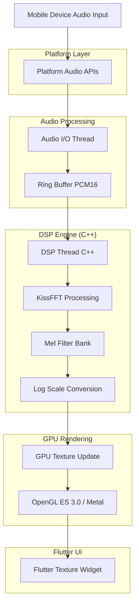
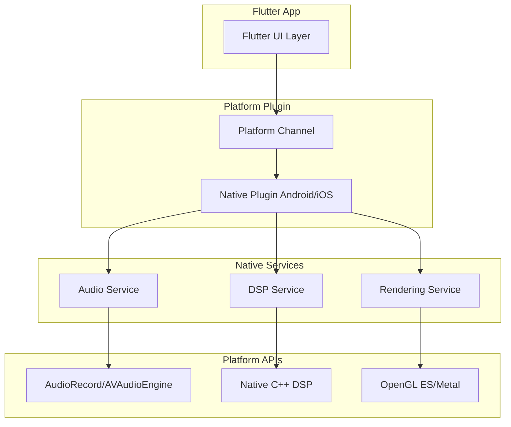

## 1. Architecture design



## 2. Technology Description

- **Frontend**: Flutter@3.16 + Dart
- **Initialization Tool**: flutter-create
- **DSP Engine**: C++17 + KissFFT
- **Platform Audio**: Android AudioRecord / iOS AVAudioEngine
- **GPU Rendering**: OpenGL ES 3.0 (Android) / Metal (iOS)
- **Build System**: CMake + Flutter Plugin

## 3. Route definitions

| Route | Purpose |
|-------|---------|
| / | メイン表示画面、リアルタイムスペクトログラム表示 |
| /settings | 設定画面、オーディオ/表示/パフォーマンス設定 |
| /export | エクスポート画面、データ/画像/動画保存 |
| /about | アプリ情報、ライセンス表示 |

## 4. Core Processing Pipeline

### 4.1 Audio Input Processing
```cpp
// Audio configuration structure
struct AudioConfig {
    int sampleRate;      // 32000 Hz
    int frameSize;       // 1024 samples
    int hopSize;         // 512 samples
    int channels;        // 1 (mono)
    int format;          // PCM16
};

// Processing pipeline
class MelSpectrogramProcessor {
public:
    void processAudioFrame(const int16_t* input, int frameSize);
    std::vector<float> getMelSpectrum();
private:
    void applyWindowFunction();
    void performFFT();
    void applyMelFilterBank();
    void convertToLogScale();
};
```

### 4.2 GPU Texture Management
```cpp
// Texture update structure
struct TextureUpdate {
    uint32_t textureId;
    int width;           // 512 pixels
    int height;          // 256 pixels
    int updateColumn;    // current column to update
    std::vector<uint8_t> colorData; // RGBA
};
```

## 5. Platform Integration Architecture



## 6. Performance Specifications

### 6.1 Target Performance Metrics
- **Latency**: ≤ 200-300ms end-to-end
- **Frame Rate**: 16-25 FPS (40-60ms update interval)
- **CPU Usage**: ≤ 15% on mid-range devices
- **Memory Usage**: ≤ 50MB total
- **Thermal**: No throttling under continuous operation

### 6.2 Optimization Strategies
- Ring buffer for zero-copy audio processing
- Single column texture updates to minimize GPU bandwidth
- SIMD optimizations for FFT and filter bank processing
- Adaptive quality based on device performance

## 7. Testing Architecture

### 7.1 Unit Testing Framework
- **C++ DSP**: Google Test framework
- **Flutter UI**: flutter_test package
- **Integration**: flutter_driver for end-to-end testing

### 7.2 Test Categories
```cpp
// DSP unit test example
TEST(MelSpectrogramTest, FrequencyDetection) {
    MelSpectrogramProcessor processor(32000, 1024, 64);
    
    // Generate test sine wave
    std::vector<int16_t> testSignal(1024);
    generateSineWave(testSignal, 1000.0f, 32000);
    
    processor.processAudioFrame(testSignal.data(), 1024);
    auto spectrum = processor.getMelSpectrum();
    
    // Verify peak detection at expected frequency
    EXPECT_NEAR(findPeakFrequency(spectrum), 1000.0f, 50.0f);
}
```

### 7.3 Performance Testing
- Automated latency measurement
- Memory leak detection
- Thermal stress testing
- Battery consumption monitoring

## 8. Data Model

### 8.1 Configuration Storage
```json
{
  "audioConfig": {
    "sampleRate": 32000,
    "frameSize": 1024,
    "hopSize": 512,
    "inputDevice": "default"
  },
  "displayConfig": {
    "colorScheme": "viridis",
    "frequencyRange": [20, 8000],
    "timeWindow": 10.0,
    "updateInterval": 50
  },
  "performanceConfig": {
    "quality": "balanced",
    "powerSaving": true,
    "adaptiveQuality": true
  }
}
```

### 8.2 Export Data Format
```json
{
  "metadata": {
    "timestamp": "2024-01-01T00:00:00Z",
    "duration": 10.0,
    "sampleRate": 32000,
    "frameSize": 1024
  },
  "spectrogramData": [
    {
      "time": 0.0,
      "melBands": [0.1, 0.2, 0.3, ...]
    }
  ]
}
```